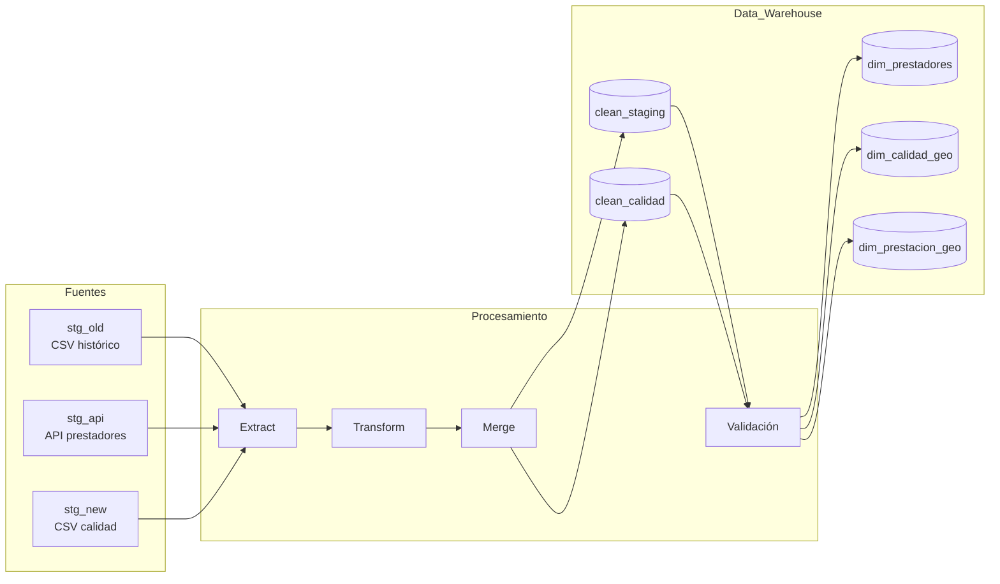
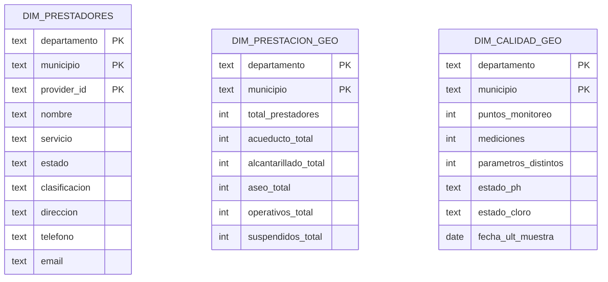
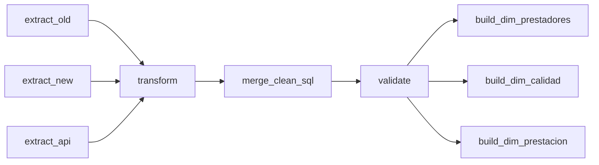

# Proyecto ETL — Agua, Alcantarillado y Aseo (Colombia)

**Entrega 2 — Orquestación con Apache Airflow y Modelo Dimensional**

**Stack:** 🐍 Python · 🐘 PostgreSQL · 🐳 Docker/Compose · 🪁 Apache Airflow · 📈 BI (Superset/Metabase/Power BI)

---

## Visión general

Implementamos un pipeline **ETL** que integra tres fuentes heterogéneas (CSV histórico de prestadores, API de prestadores y CSV de calidad del agua), estandariza y valida los datos, y publica tres **dimensiones conformes** al grano **Departamento–Municipio** (y `provider_id` en la dimensión de prestadores). El diseño sigue **modelado dimensional (Kimball)**, lo que permite consultas en **esquema estrella** y *drill-across* entre dominios (prestación ↔ calidad) usando dimensiones compartidas. ([Kimball Group][1])

La orquestación se realiza con **Apache Airflow**, declarando dependencias, reintentos y programación como código (**DAGs**). ([Apache Airflow][2])

---

## Arquitectura y flujo

> **Cómo leer los diagramas:** en GitHub, Mermaid debe ir dentro de un bloque con ```mermaid y cada flecha en su propia línea (el render es estricto). ([GitHub Docs][3])



---

## Datasets y transformaciones

### 1) Prestadores (`stg_old` + `stg_api` → `clean_staging`)

* **Normalización**: mayúsculas, *trim* y eliminación de tildes.
* **Clave**: `provider_id = COALESCE(nit, md5(UPPER(nombre)|dep|mun|servicio))`.
* **Servicio**: mapeo a `{ACUEDUCTO, ALCANTARILLADO, ASEO}`; cualquier valor fuera del dominio se etiqueta como `DESCONOCIDO` para mantener consistencia aguas abajo.
* **Estado**: consolidación a `{OPERATIVA, SUSPENDIDA, OTRO}` (imputación por moda cuando aplica).
* **Contacto**: `direccion`, `telefono`, `email` preservados si los trae `stg_old` (nulos para `stg_api`).
* **Deduplicación**: `(provider_id, servicio, departamento, municipio)`.

**Salida**
`clean_staging(provider_id, nombre, departamento, municipio, servicio, estado, clasificacion, direccion, telefono, email)`.

### 2) Calidad del agua (`stg_new` → `clean_calidad`)

* **Fecha**: *parse* robusto a `fecha_muestra`.
* **Valor**: limpieza de símbolos y *cast* a `double precision`.
* **Coordenadas**: validación para **Colombia** (lat ∈ [−5, 15], lon ∈ [−82, −66]); si falta una, ambas a `NULL`.
* **Plausibilidad**:

  * **pH** ∈ [0, 14].
  * **Cloro residual**: plausibilidad 0–5 mg/L; como guía operativa, mantener **residuales de unas décimas de mg/L** en la red, con ≥ **0.5 mg/L** tras ≥ **30 min** de contacto a pH < 8 y ≥ **0.2 mg/L** en el punto de entrega (estos umbrales se usan como KPI, no para descartar filas). ([NCBI][4])
* **Unicidad**: `(departamento, municipio, parametro, fecha_muestra, nombre_punto)`.

**Salida**
`clean_calidad(departamento, municipio, parametro, valor, fecha_muestra, unidad, nombre_punto, latitud, longitud)`.

---

## Modelo dimensional (estrella)

Publicamos tres dimensiones con claves primarias **departamento** + **municipio** (y **provider_id** en prestadores). El uso de **dimensiones conformes** alinea ejes analíticos entre procesos distintos y habilita *drill-across* seguro. ([Kimball Group][1])



> Si en el futuro agregas **hechos** (p. ej., mediciones diarias o eventos operativos), mantén las dimensiones conformes para que las comparaciones entre *facts* sigan la regla de **drill-across**. ([Kimball Group][5])

---

## Orquestación (DAG de Airflow)

Orden de ejecución en producción:

```
extract_old, extract_new, extract_api
  → transform
  → merge_clean_sql
  → validate
  → build_dim_prestadores, build_dim_calidad, build_dim_prestacion
```

Airflow modela flujos como **DAGs**: colecciones de tareas con dependencias y programación, gestionando reintentos, *logging* y visualización. ([Apache Airflow][2])



---

## Validación de datos

La validación corre como tarea y **frena el DAG** ante fallas críticas, alineada con las **seis dimensiones de calidad** (exactitud, completitud, consistencia, unicidad, validez y vigencia) recomendadas por DAMA. ([Apache Airflow][6])

**Críticos (bloquean):**

* Nulos en llaves (`clean_staging`: provider_id/departamento/municipio/servicio; `clean_calidad`: departamento/municipio/parametro/fecha_muestra).
* Duplicados por llaves lógicas.
* Fechas fuera de rango; lat/lon fuera de Colombia o despareadas.
* Plausibilidad (pH y cloro) fuera de los límites definidos.

**Informativos (no bloquean):**

* % de `DESCONOCIDO` en `servicio` por encima del umbral.
* E-mails y teléfonos con formato dudoso.
* Colisiones municipio–día–parámetro para revisión.

---

## KPIs y visualizaciones sugeridas

* **Prestación**: total de prestadores por municipio/servicio; % operativos vs. suspendidos.
* **Calidad**: *semáforos* por municipio para pH y cloro; # de puntos y mediciones; fecha de última muestra.
* **Cobertura**: municipios sin mediciones en el período analizado.

> Los tableros (Superset/Metabase/Power BI) deben consumir **`dim_*`**; las claves geográficas compartidas garantizan comparabilidad entre dominios mediante **dimensiones conformes**. ([Kimball Group][1])

---

## Ejecución local (Docker/Compose)

1. **Levantar servicios**

```bash
docker compose up -d
```

2. **Disparar el DAG**

* UI: `http://localhost:8080`
* CLI:

```bash
docker compose exec scheduler airflow dags trigger etl
```

3. **Consultas rápidas (PostgreSQL)**

```sql
-- Conteos base
SELECT COUNT(*) FROM clean_staging;
SELECT COUNT(*) FROM clean_calidad;

-- Catálogo de servicio final
SELECT servicio, COUNT(*) FROM clean_staging GROUP BY 1 ORDER BY 2 DESC;

-- Duplicados lógicos (esperado: 0)
SELECT COUNT(*) FROM (
  SELECT provider_id, servicio, departamento, municipio, COUNT(*) c
  FROM clean_staging
  GROUP BY 1,2,3,4 HAVING COUNT(*)>1
) t;
```

---

## Notas sobre Mermaid en GitHub

* Usa bloques con ```mermaid y **una flecha por línea**.
* Los títulos de `subgraph` deben ser simples (evita caracteres que rompan el parser).
  Documentación oficial: GitHub + Mermaid OSS. ([GitHub Docs][3])

---

## Referencias

* **Kimball Group** — *Dimensional Modeling Techniques: Drilling Across* (dimensiones conformes y *drill-across*). ([Kimball Group][1])
* **Apache Airflow** — Conceptos y DAGs (documentación oficial). ([Apache Airflow][2])
* **GitHub** — Crear diagramas Mermaid en Markdown. ([GitHub Docs][3])
* **Mermaid** — Sintaxis básica de *flowcharts* (referencia OSS). ([docs.mermaidchart.com][7])
* **OMS/WHO** — Recomendación operativa de cloro residual (≥0.5 mg/L tras ≥30 min, ≥0.2 mg/L en entrega). ([NCBI][4])

---

[1]: https://www.kimballgroup.com/data-warehouse-business-intelligence-resources/kimball-techniques/dimensional-modeling-techniques/drilling-across/?utm_source=chatgpt.com "Drilling Across - Dimensional Modeling Techniques"
[2]: https://airflow.apache.org/docs/apache-airflow/stable/core-concepts/dags.html?utm_source=chatgpt.com "Dags — Airflow 3.1.0 Documentation"
[3]: https://docs.github.com/en/get-started/writing-on-github/working-with-advanced-formatting/creating-diagrams?utm_source=chatgpt.com "Creating Mermaid diagrams"
[4]: https://www.ncbi.nlm.nih.gov/books/NBK579467/table/ch8.tab17/?utm_source=chatgpt.com "Table 8.17, Guideline values for chemicals used in water ..."
[5]: https://www.kimballgroup.com/2003/04/the-soul-of-the-data-warehouse-part-two-drilling-across/?utm_source=chatgpt.com "The Soul of the Data Warehouse, Part 2: Drilling Across"
[6]: https://airflow.apache.org/docs/apache-airflow/stable/core-concepts/index.html?utm_source=chatgpt.com "Core Concepts — Airflow 3.1.0 Documentation"
[7]: https://docs.mermaidchart.com/mermaid-oss/syntax/flowchart.html?utm_source=chatgpt.com "Mermaid FlowChart Basic Syntax"
