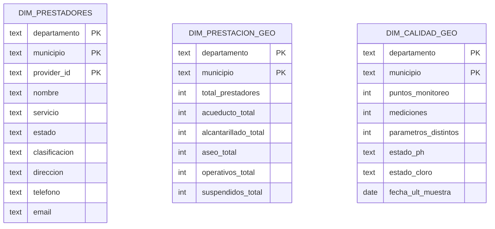
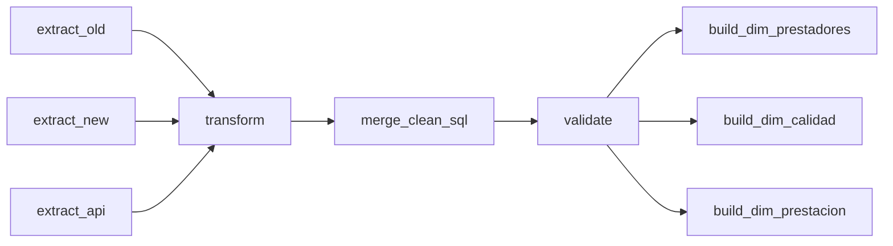

# Proyecto ETL — Agua, Alcantarillado y Aseo (Colombia)

**Entrega 2 — Orquestación en Apache Airflow y Modelo Dimensional**

**Stack:** 🐍 Python · 🐘 PostgreSQL · 🐳 Docker/Compose · 🪁 Apache Airflow · 📈 BI (Superset/Metabase/Power BI)

---

## Visión general

Se implementa un pipeline **ETL** que integra tres fuentes heterogéneas (histórico CSV de prestadores, API de prestadores y CSV de calidad del agua), estandariza y valida los datos, y publica tres **dimensiones conformes** a nivel **Departamento–Municipio** (y `provider_id` para prestadores). El diseño sigue **modelado dimensional (Kimball)** para facilitar consultas en estrella y *drill-across* entre dominios (prestación ↔ calidad). ([Kimball Group][1])

La orquestación se realiza con **Apache Airflow**, declarando dependencias, reintentos y programación como código (DAG). ([Apache Airflow][2])

---

## Arquitectura y flujo

```mermaid
flowchart LR
  subgraph Fuentes
    S1["stg_old\nCSV histórico"]
    S2["stg_api\nAPI prestadores"]
    S3["stg_new\nCSV calidad"]
  end

  subgraph Procesamiento
    E[Extract (extract_*)]
    T[Transform (src/transform.py)]
    M[Merge (sql/merge_pipeline.sql)]
    V[Validación (src/checks_cli.py)]
  end

  subgraph Data_Warehouse
    C1[(clean_staging)]
    C2[(clean_calidad)]
    D1[(dim_prestadores)]
    D2[(dim_calidad_geo)]
    D3[(dim_prestacion_geo)]
  end

  S1 --> E
  S2 --> E
  S3 --> E
  E --> T
  T --> M
  M --> C1
  M --> C2
  C1 --> V
  C2 --> V
  V --> D1
  V --> D2
  V --> D3
```

> **Nota:** Mermaid en GitHub exige sintaxis estricta en `subgraph` y no admite abreviaturas como `A --> B & C`; cada arista debe declararse en su propia línea. ([mermaid.js.org][3])

---

## Datasets y transformaciones

### 1) Prestadores (`stg_old` + `stg_api` → `clean_staging`)

* **Normalización**: mayúsculas, *trim* y eliminación de tildes para reducir cardinalidad.
* **Clave**: `provider_id = COALESCE(nit, md5(UPPER(nombre)|dep|mun|servicio))`.
* **Servicio**: mapeo a `ACUEDUCTO / ALCANTARILLADO / ASEO`; valores fuera del dominio → `DESCONOCIDO` para consistencia aguas abajo (validación y dimensiones).
* **Estado**: consolidación a `OPERATIVA / SUSPENDIDA / OTRO` (imputación por moda cuando procede).
* **Contacto**: `direccion`, `telefono`, `email` preservados desde `stg_old` (nulos para `stg_api`).
* **Deduplicación**: `(provider_id, servicio, departamento, municipio)`.

**Salida**
`clean_staging(provider_id, nombre, departamento, municipio, servicio, estado, clasificacion, direccion, telefono, email)`.

### 2) Calidad del agua (`stg_new` → `clean_calidad`)

* **Fecha**: praseo robusto a `fecha_muestra`.
* **Valor**: limpieza de símbolos y *cast* a `double precision`.
* **Coordenadas**: validación de **rango Colombia** (lat ∈ [−5, 15], lon ∈ [−82, −66]) y **emparejamiento** de nulidad (si falta una, ambas a `NULL`).
* **Plausibilidad**:

  * **pH** ∈ [0, 14] (filtro de outliers).
  * **Cloro residual**: plausibilidad 0–5 mg/L; en operación, se recomienda mantener residuales de “unas décimas de mg/L” a lo largo de la red, con ≥0.5 mg/L tras 30 min de contacto y mínimo 0.2 mg/L en punto de entrega (estas metas se analizan como KPI, no para descartar filas). ([World Health Organization][4])
* **Unicidad**: `(departamento, municipio, parametro, fecha_muestra, nombre_punto)`.

**Salida**
`clean_calidad(departamento, municipio, parametro, valor, fecha_muestra, unidad, nombre_punto, latitud, longitud)`.

---

## Modelo dimensional (estrella)

Se implementan **tres dimensiones** con claves primarias `departamento` + `municipio` (y `provider_id` en prestadores). El uso de **dimensiones conformes** permite alinear resultados de distintos procesos (prestación y calidad) en los mismos ejes geográficos, habilitando *drill-across* sin ambigüedades. ([Kimball Group][1])



---

## Orquestación (DAG de Airflow)

Orden de ejecución en producción:

```
extract_old, extract_new, extract_api
  → transform
  → merge_clean_sql
  → validate
  → build_dim_prestadores, build_dim_calidad, build_dim_prestacion
```

Airflow interpreta cada **Operator** como una tarea idempotente y el **DAG** define dependencias, reintentos y programación como código. ([Apache Airflow][5])



---

## Validación de datos

La validación corre como **task** y detiene el DAG ante fallas críticas. Las reglas se alinean con las **seis dimensiones DAMA** (exactitud, completitud, consistencia, unicidad, validez y vigencia). ([sbctc.edu][6])

**Críticos (bloquean)**

* Nulos en llaves (`clean_staging`: provider_id/departamento/municipio/servicio; `clean_calidad`: departamento/municipio/parametro/fecha_muestra).
* Duplicados por llaves lógicas.
* Fechas fuera de rango razonable; lat/lon fuera de Colombia o despareadas.
* Plausibilidad de pH y cloro (outliers).

**Informativos (no bloquean)**

* % de `DESCONOCIDO` en servicio por encima del umbral.
* Correos y teléfonos con formato dudoso.
* Colisiones municipio–día–parámetro para revisión manual.

> El *merge* normaliza el catálogo de `servicio` a `{ACUEDUCTO, ALCANTARILLADO, ASEO, DESCONOCIDO}`, lo que evita quiebres posteriores en las dimensiones.

---

## KPIs y visualizaciones

* **Prestación**: total de prestadores por municipio/servicio; % operativos vs. suspendidos.
* **Calidad**: semáforos municipales para pH y cloro; número de puntos; fecha de última muestra.
* **Cobertura**: municipios sin mediciones en el período analizado.

Los tableros (Superset/Metabase/Power BI) deben consumir **directamente `dim_*`**; la conformidad de claves geográficas garantiza comparabilidad entre dominios (principio de conformed dimensions). ([Kimball Group][1])

---

## Ejecución local (Docker/Compose)

1. **Levantar servicios**

   ```bash
   docker compose up -d
   ```
2. **Disparar el DAG**

   * UI: `http://localhost:8080`
   * CLI:

     ```bash
     docker compose exec scheduler airflow dags trigger etl
     ```
3. **Consultas rápidas (PostgreSQL)**

   ```sql
   -- Conteos base
   SELECT COUNT(*) FROM clean_staging;
   SELECT COUNT(*) FROM clean_calidad;

   -- Catálogo de servicio final
   SELECT servicio, COUNT(*) FROM clean_staging GROUP BY 1 ORDER BY 2 DESC;

   -- Duplicados lógicos (esperado: 0)
   SELECT COUNT(*) FROM (
     SELECT provider_id, servicio, departamento, municipio, COUNT(*) c
     FROM clean_staging
     GROUP BY 1,2,3,4 HAVING COUNT(*)>1
   ) t;
   ```

---

## Solución de problemas

* **Mermaid no renderiza**: verifica `subgraph` y declara una arista por línea; GitHub exige sintaxis estricta. ([mermaid.js.org][3])
* **Falla de validación por catálogo**: confirmar que el *merge* mapea servicio a `{ACUEDUCTO, ALCANTARILLADO, ASEO, DESCONOCIDO}`.
* **Lat/Lon despareadas**: la limpieza empareja nulos; si persiste, revisar `stg_new`.

---

## Referencias

* **Kimball Group** — *Dimensional Modeling Techniques* (Conformed Dimensions, *drill-across*). ([Kimball Group][1])
* **DAMA** — *The Six Primary Dimensions for Data Quality Assessment*; resumen CDC. ([sbctc.edu][6])
* **OMS/WHO** — *Chlorine chemical fact sheet*; residuales operativos y mínimos recomendados. ([World Health Organization][4])
* **Apache Airflow** — Conceptos de DAGs y Operators. ([Apache Airflow][2])
* **Mermaid** — Sintaxis y particularidades para GitHub. ([mermaid.js.org][3])

---

[1]: https://www.kimballgroup.com/data-warehouse-business-intelligence-resources/kimball-techniques/dimensional-modeling-techniques/conformed-dimension/?utm_source=chatgpt.com "Dimensional Modeling Techniques - Conformed Dimensions"
[2]: https://airflow.apache.org/docs/apache-airflow/stable/core-concepts/dags.html?utm_source=chatgpt.com "Dags — Airflow 3.1.0 Documentation"
[3]: https://mermaid.js.org/intro/syntax-reference.html?utm_source=chatgpt.com "Diagram Syntax"
[4]: https://www.who.int/docs/default-source/wash-documents/wash-chemicals/chlorine-chemical-fact-sheet.pdf?utm_source=chatgpt.com "guidelines for drinking-water quality 334"
[5]: https://airflow.apache.org/docs/apache-airflow/stable/howto/operator/index.html?utm_source=chatgpt.com "Using Operators — Airflow 3.1.0 Documentation"
[6]: https://www.sbctc.edu/resources/documents/colleges-staff/commissions-councils/dgc/data-quality-deminsions.pdf?utm_source=chatgpt.com "The Six Primary Dimensions for Data Quality Assessment"
