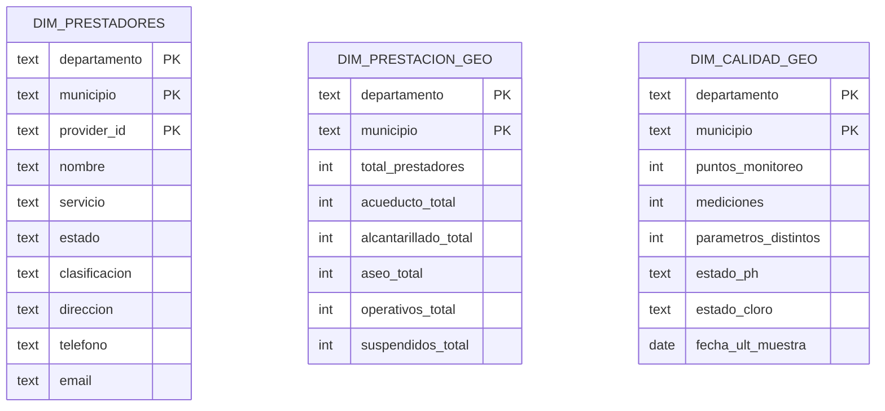
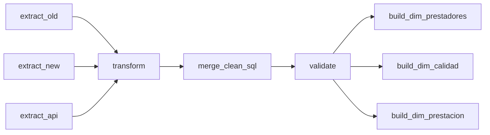

# Proyecto ETL — Agua, Alcantarillado y Aseo (Colombia)

> **Entrega 2** — Integración de prestadores (histórico + API) y calidad del agua en un **modelo dimensional** con validación automática y orquestación en **Apache Airflow**.

---

## Índice

* [Visión general](#visión-general)
* [Arquitectura y flujo](#arquitectura-y-flujo)
* [Datasets y transformaciones](#datasets-y-transformaciones)
* [Modelo dimensional](#modelo-dimensional)
* [Orquestación (DAG de Airflow)](#orquestación-dag-de-airflow)
* [Validación de datos](#validación-de-datos)
* [KPIs y visualizaciones](#kpis-y-visualizaciones)
* [Ejecución local](#ejecución-local)
* [Solución de problemas](#solución-de-problemas)
* [Referencias](#referencias)

---

## Visión general

Este proyecto implementa un **pipeline ETL** que integra tres fuentes heterogéneas (CSV histórico de prestadores, API de prestadores y CSV de calidad del agua) y publica tres **dimensiones** a nivel **Departamento–Municipio** (más `provider_id` para prestadores). Se adopta un enfoque de **modelado dimensional** (Kimball) con **dimensiones conformes** para habilitar análisis consistentes en múltiples procesos y facilitar *drill-across* entre dominios de prestación y calidad. ([Kimball Group][1])

El flujo se orquesta con **Apache Airflow**, declarando dependencias, reintentos y programación como código (DAG). ([Apache Airflow][2])
Se opta por **ETL** (transformar antes de cargar al DW) por trazabilidad y control temprano de la calidad; ELT se reserva para escalamiento futuro. ([IBM][3])

---

## Arquitectura y flujo

```mermaid
flowchart LR
  subgraph S[Fuentes]
    S1[stg_old\nCSV histórico]
    S2[stg_api\nAPI prestadores]
    S3[stg_new\nCSV calidad agua]
  end
  subgraph P[Procesamiento (ETL en Airflow)]
    E[Extract\nextract_*]
    T[Transform\nsrc/transform.py]
    M[Merge\nsql/merge_pipeline.sql]
    V[Validación\nsrc/checks_cli.py]
  end
  subgraph D[Data Warehouse]
    C1[(clean_staging)]
    C2[(clean_calidad)]
    DIM1[(dim_prestadores)]
    DIM2[(dim_calidad_geo)]
    DIM3[(dim_prestacion_geo)]
  end
  S1 --> E
  S2 --> E
  S3 --> E
  E --> T --> M
  M --> C1 & C2 --> V
  V --> DIM1 & DIM2 & DIM3
```

**Capas:**

* **Staging** (`stg_*`): extracción bruta.
* **Clean**: estandarización, deduplicación y reglas de plausibilidad.
* **Dimensiones**: cortes analíticos por geografía y prestadores.

---

## Datasets y transformaciones

### Prestadores (`stg_old` + `stg_api` → `clean_staging`)

* **Normalización**: `UPPER + TRIM + quitar tildes`.
* **Clave**: `provider_id = COALESCE(nit, md5(UPPER(nombre)|dep|mun|servicio))`.
* **Servicio**: mapeo a `ACUEDUCTO / ALCANTARILLADO / ASEO`; valores fuera del dominio → `DESCONOCIDO` (para consistencia en validación).
* **Estado**: consolidación a `OPERATIVA / SUSPENDIDA / OTRO`.
* **Contacto**: `direccion`, `telefono`, `email` preservados cuando vienen de `stg_old` (nulos en `stg_api`).
* **Deduplicación**: `(provider_id, servicio, departamento, municipio)`.

**Salida**
`clean_staging(provider_id, nombre, departamento, municipio, servicio, estado, clasificacion, direccion, telefono, email)`.

### Calidad del agua (`stg_new` → `clean_calidad`)

* **Fecha**: `fecha_muestra` desde formatos mixtos (robusto a `YYYY Mon DD HH:MM:SS AM/PM` o `::date`).
* **Valor**: limpieza a `valor` (`double precision`).
* **Geo**: validación para Colombia (lat ∈ [−5, 15], lon ∈ [−82, −66]) y **pareo** de nulidad (si falta una coordenada, ambas a `NULL`).
* **Plausibilidad**:

  * `pH` ∈ [0, 14].
  * **Cloro residual**: rango de plausibilidad 0–5 mg/L; la OMS recomienda mantener residual **en décimas de mg/L** en distribución (práctica normal “a few tenths”), y mantener ≥0.5 mg/L tras 30 min de contacto en planta, con mínimo 0.2 mg/L en punto de entrega. Estas metas operativas se analizan aguas arriba, no se usan para descartar filas. ([World Health Organization][4])
* **Unicidad**: `(departamento, municipio, parametro, fecha_muestra, nombre_punto)`.

**Salida**
`clean_calidad(departamento, municipio, parametro, valor, fecha_muestra, unidad, nombre_punto, latitud, longitud)`.

---

## Modelo dimensional

Se entrega un **modelo en estrella** centrado en dimensiones conformes de **Departamento–Municipio**; en prestadores se agrega `provider_id` como parte de la clave. Este diseño simplifica las consultas y habilita análisis consistentes entre dominios, siguiendo Kimball. ([Kimball Group][1])



---

## Orquestación (DAG de Airflow)

Orden de tareas en producción:

```
extract_old, extract_new, extract_api
  → transform
  → merge_clean_sql
  → validate
  → build_dim_prestadores, build_dim_calidad, build_dim_prestacion
```

**Conceptos clave:** un **DAG** define tareas y dependencias; Airflow programa, ejecuta y monitoriza el flujo con reintentos y logging por tarea. ([Apache Airflow][5])

Diagrama del DAG:



---

## Validación de datos

La validación corre como **task** y bloquea el DAG ante fallas **críticas**:

**Críticos (bloquean)**

* Nulos en llaves (`clean_staging`: provider_id/departamento/municipio/servicio; `clean_calidad`: departamento/municipio/parametro/fecha_muestra).
* Duplicados en claves lógicas.
* Fechas fuera de rango razonable; lat/lon fuera de Colombia o despareadas.
* Plausibilidad: `pH` y **Cloro** fuera de rangos de control.

**Informativos (no bloquean)**

* Porcentaje de `DESCONOCIDO` por encima del umbral configurado.
* Formatos dudosos de `email`/`telefono`.
* Colisiones municipio–día–parámetro para revisión.

Las reglas se alinean con las **Dimensiones DAMA** (exactitud, completitud, consistencia, unicidad, validez y vigencia) para asegurar datos aptos para análisis. ([sbctc.edu][6])

---

## KPIs y visualizaciones

* **Prestación**: número de prestadores por municipio/servicio; % operativos vs. suspendidos.
* **Calidad**: semáforos municipales para pH y cloro; número de puntos y mediciones; fecha de última muestra.
* **Cobertura**: municipios sin mediciones en el período seleccionado.

Tableros recomendados: **Superset**, **Metabase** o **Power BI**, consumiendo directamente `dim_*`.

---

## Ejecución local

### Requisitos

* Docker + Docker Compose
* PostgreSQL dentro del *stack*
* Python 3.12 en contenedores de Airflow

### Comandos típicos

```bash
# Subir servicios
docker compose up -d

# Ejecutar DAG manualmente (desde la UI o CLI)
# UI: http://localhost:8080
# CLI:
docker compose exec scheduler airflow dags trigger etl
```

### Consultas rápidas (PostgreSQL)

```sql
-- Conteos de control
SELECT COUNT(*) FROM clean_staging;
SELECT COUNT(*) FROM clean_calidad;

-- Catálogo de servicios final
SELECT servicio, COUNT(*) FROM clean_staging GROUP BY 1 ORDER BY 2 DESC;

-- Duplicados lógicos (esperado: 0)
SELECT COUNT(*) FROM (
  SELECT provider_id, servicio, departamento, municipio, COUNT(*) c
  FROM clean_staging
  GROUP BY 1,2,3,4 HAVING COUNT(*)>1
) t;
```

---

## Solución de problemas

* **Falla en `validate` por servicios fuera de catálogo**: revisar que el **merge** normalice a `ACUEDUCTO / ALCANTARILLADO / ASEO / DESCONOCIDO`.
* **Nulos en llaves**: confirmar que `transform` purga filas con claves vacías y que el dominio de Departamento corresponde al catálogo.
* **Lat/Lon despareadas**: la limpieza empareja nulos; revisar `stg_new` si persisten inconsistencias.

---

## Referencias

* Kimball Group — *Dimensional Modeling Techniques* (conformed dimensions, drill-across). ([Kimball Group][1])
* Apache Airflow — *Core concepts / DAGs*. ([Apache Airflow][2])
* DAMA UK — *Six Primary Dimensions for Data Quality Assessment*. ([sbctc.edu][6])
* WHO — *Chlorine chemical fact sheet*; NCBI/WHO sobre residual de cloro en distribución. ([World Health Organization][4])
* IBM — *ELT vs. ETL: Main differences*. ([IBM][3])

---

> **Nota**: si necesitas incorporar los **totales** del último run (p. ej., `clean_staging = 11,903`; `clean_calidad = 132,985`; `dim_calidad_geo = 167`; `dim_prestacion_geo = 1,103`; `dim_prestadores = 9,357`), añade un breve bloque en “Visión general” o al final de “Validación de datos”.

[1]: https://www.kimballgroup.com/data-warehouse-business-intelligence-resources/kimball-techniques/dimensional-modeling-techniques/?utm_source=chatgpt.com "Dimensional Modeling Techniques"
[2]: https://airflow.apache.org/docs/apache-airflow/stable/core-concepts/index.html?utm_source=chatgpt.com "Core Concepts — Airflow 3.1.0 Documentation"
[3]: https://www.ibm.com/think/topics/elt-vs-etl?utm_source=chatgpt.com "ELT vs. ETL: Similarities and Differences"
[4]: https://www.who.int/docs/default-source/wash-documents/wash-chemicals/chlorine-chemical-fact-sheet.pdf?utm_source=chatgpt.com "guidelines for drinking-water quality 334"
[5]: https://airflow.apache.org/docs/apache-airflow/stable/core-concepts/dags.html?utm_source=chatgpt.com "Dags — Airflow 3.1.0 Documentation"
[6]: https://www.sbctc.edu/resources/documents/colleges-staff/commissions-councils/dgc/data-quality-deminsions.pdf?utm_source=chatgpt.com "The Six Primary Dimensions for Data Quality Assessment"
